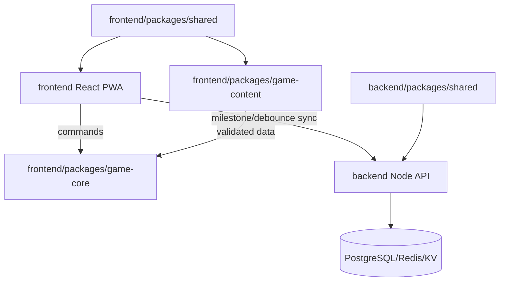

# Kiến trúc đích

## Biên hệ thống

## Hai project độc lập

- `frontend` và `backend` là hai npm project riêng, không dùng chung một workspace root.
- TypeScript strict; project references trong từng project khi có lợi.
- `frontend/packages/game-core`: domain thuần; không DOM, React, storage, fetch, Cloudflare API.
- `frontend/packages/game-content`: content typed, Zod schema, validator graph và asset reference.
- `*/packages/shared`: API contract, constants, validation (bản đồng bộ ở frontend và backend).
- `frontend`: adapter persistence/localStorage, React UI, PWA và cloud sync queue.
- `backend`: Node HTTP routing, auth session ẩn danh và abstraction lưu save; phù hợp VPS/Render, có thể thêm serverless adapter.

## Game core

State bất biến đổi qua `dispatch(state, command, content)`. Command chính:

- `START_GAME`
- `SELECT_ACTIVITY`
- `CHOOSE_EVENT_OPTION`
- `ADVANCE_MONTH`
- `CONFIRM_STOP_JOURNEY`
- `RESTORE_SAVE`

State chứa `schemaVersion`, seed, RNG state, calendar, action points, stats, relationships, traits, flags, history, event runtime, delayed consequences và ending state. Seeded PRNG dùng thuật toán khai báo/version hóa. Scheduler lọc prerequisite, one-shot, cooldown; sau đó weighted draw. Pity tăng weight hoặc ép event bắt buộc trước deadline.

## Save

- Local-first; autosave sau choice, event và mốc tháng.
- Envelope version hóa và migration tuần tự.
- Import `vn_slot_0..3` một lần, lưu bản legacy dự phòng đến khi save mới xác nhận ghi thành công.
- Cloud sync tại milestone hoặc debounce; queue hoạt động offline.
- Conflict dùng `revision` và `ETag`; UI cho giữ local, cloud hoặc bản mới nhất.

## Frontend

- Vite + React + TypeScript; component chỉ gửi command và render view model.
- Mobile-first, semantic HTML, focus management, keyboard, ARIA live cho thoại/chỉ số.
- `prefers-reduced-motion`, cỡ chữ, tốc độ thoại; skip chỉ với nội dung đã đọc.
- Route/chunk theo màn và chapter. Asset runtime tên ASCII kebab-case, AVIF/WebP, lazy-load.
- PWA precache app shell/content thiết yếu; stale-while-revalidate asset hash; network-first API với fallback queue.

## API

Endpoint đúng `/v1`. Validation Zod, body giới hạn, save slot quota, request ID, CORS allowlist, structured redacted log. Token session ở header; không log token/save payload. Write hỗ trợ idempotency và conditional request.

Dữ liệu session/profile/save không public-cache: `Cache-Control: private, no-store`. Health có cache ngắn tùy deployment.

## Edge và bảo mật

- Worker Static Assets phát frontend; file hash `immutable`, HTML cache ngắn/revalidate.
- WAF chặn path/method/content-type bất thường và payload quá lớn trước Worker.
- Rate limit riêng session, save read, save write; domain quota vẫn bắt buộc trong Worker.
- VPS tương lai chỉ kết nối Tunnel outbound-only; DNS không có origin IP; firewall chỉ cho quản trị riêng và chặn public origin.
- Không tuyên bố chống DDoS tuyệt đối.

## Kiểm thử

- Unit: reducer, RNG, scheduler, delayed effects, ending resolver, migration.
- Story validation: đúng 14 ending, graph/asset/reference, choice-effect, event bắt buộc.
- Fixture: một path/state đạt từng ending.
- Simulation: nhiều seed và chiến lược học, tiền, quan hệ, sức khỏe, vé số.
- Integration: Worker API, ETag, idempotency, quota, CORS.
- E2E: 48 tháng, offline save, settings, gallery, keyboard, stop confirmation.
